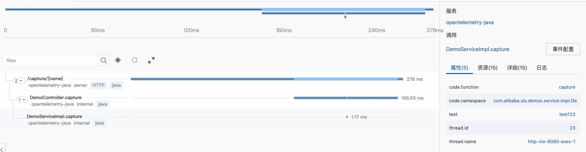
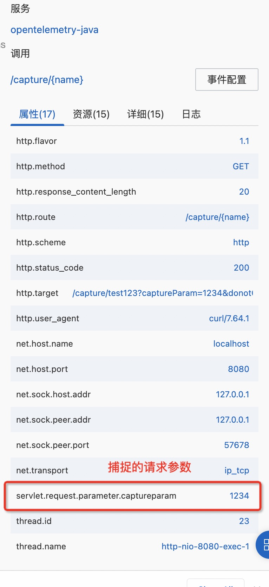
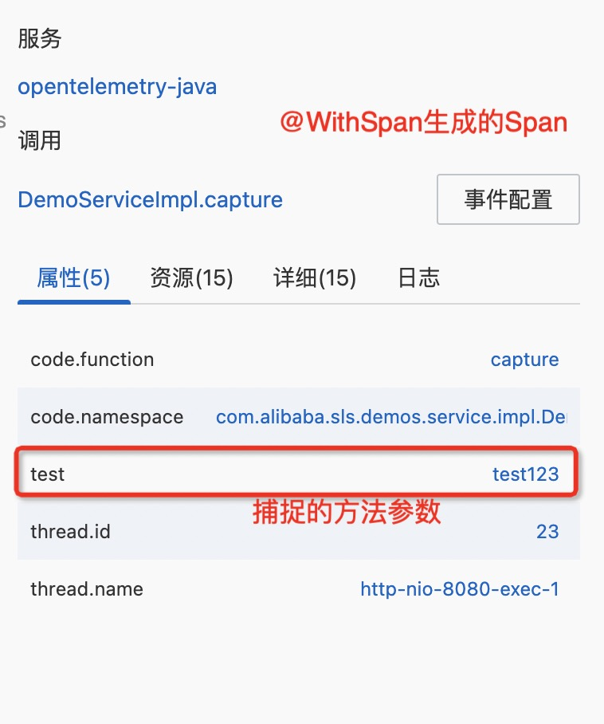

# Capture Parameter Demo

**注意**： 建议使用最新版本的JavaAgent，否则会出现埋点不生效的问题，本例子使用1.21.0版本


## 依赖组件

- JDK 1.8u252+

## 快速启动

1. 构建应用

```shell
./mvnw clean package
```

2. 启动服务

```shell
# 设置需要捕捉的请求参数
export OTEL_INSTRUMENTATION_SERVLET_EXPERIMENTAL_CAPTURE_REQUEST_PARAMETERS=captureParam
export PROJECT=<PROJECT_NAME>
export INSTANCE=<INSTANCE>
export ACCESS_KEY_ID=<ACCESS_KEY_ID>
export ACCESS_SECRET=<ACCESS_SECRET>
export OTEL_EXPORTER_OTLP_ENDPOINT=${ENDPOINT}
export SERVICE_NAME=opentelemetry-java
export SERVICE_VERSION=v1.0.0
export SERVICE_HOST=127.0.0.1
export OTEL_EXPORTER_OTLP_HEADERS=x-sls-otel-project=${PROJECT},x-sls-otel-instance-id=${INSTANCE},x-sls-otel-ak-id=${ACCESS_KEY_ID},x-sls-otel-ak-secret=${ACCESS_SECRET}
export SERVICE_NAMESPACE=opentelemetry-demo
java -javaagent:$PWD/agents/opentelemetry-javaagent.jar -Dotel.resource.attributes=service.name=${SERVICE_NAME},service.version=${SERVICE_VERSION},host.name=${SERVICE_HOST},service.namespace=${SERVICE_NAMESPACE} -jar $PWD/target/capture-parameter.jar
```
各参数详细介绍:

|参数名|参数描述|
|:---|:---|
|ACCESS_KEY_ID| 阿里云账号AccessKey ID。<br/>建议您使用只具备日志服务Project写入权限的RAM用户的AccessKey（包括AccessKey ID和AccessKey Secret）。|
|ACCESS_SECRET| 阿里云账号AccessKey Secret。<br/>建议您使用只具备日志服务Project写入权限的RAM用户的AccessKey。|
|PROJECT_NAME|日志服务Project名称。 |
|INSTANCE|Trace服务实例名称。 |
|ENDPOINT|接入地址，格式为https://${project}.${region-endpoint}:10010，其中：<br/> ${project}：日志服务Project名称。<br/>${region-endpoint}：Project访问域名，支持公网和阿里云内网（经典网络、VPC）。 |
|SERVICE_NAME|服务名|
|SERVICE_VERSION|服务版本号。建议按照va.b.c格式定义。|


3. 访问服务

```shell
curl http://localhost:8080/capture/test123?captureParam=1234&donotCaputureParam=456
```

4. 效果展示

生成的Trace
[](./img/trace-detail.jpg)

捕捉的请求参数
[](./img/capture-parameter.jpg)

`@WithSpan`生成的Span
[](./img/withSpan.jpg)